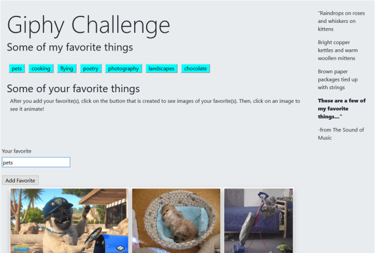

# Giphy
Here are a few of my favorite things. You can add yours too, and then see ten images of your favorites when you click on the generated buttons. When you click on a still gif, it should animate.

## Screenshot

## Usage 

This site is a fun way for the user to add some of their favorite things, and then see a button created with that topic. Plus, when they click on the button, ten images of that particular subject appear below the list of items. Once the images appear, the user can also click on the still image to make it animate.

## Languages Used
Html, css, javascript, jquery, Bootstrap, ajax, Giphy API

## Purpose

The purpose of this project was to learn how to use javascript and jquery in tandem to dynamically create buttons, display them with jquery, and assign onclick events that would trigger an API call to the Giphy API site. At this point in time, we were learning how to make API calls with Ajax.

